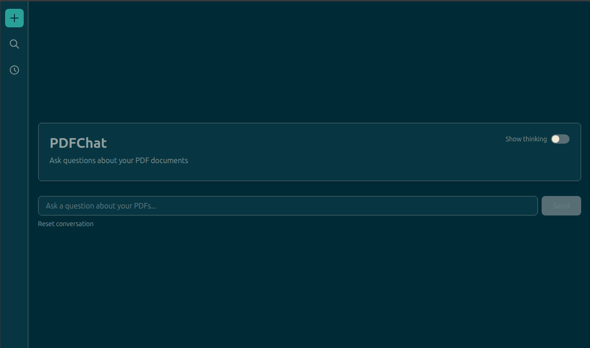

# PDFChat - Local PDF Q&A Chatbot

A fully local PDF question-answering chatbot built with Flask, LlamaIndex, and Ollama. Ask questions about your PDF documents using a web interface with streaming responses.



## Features

- **Fully Local**: No external API calls - everything runs on your machine
- **PDF Support**: Recursively processes PDFs from a folder with subdirectories
- **RAG (Retrieval Augmented Generation)**: Uses vector similarity search to find relevant context
- **Streaming Responses**: Real-time streaming of LLM responses
- **Modern UI**: Clean web interface built with HTMX and Alpine.js
- **Single Install**: Managed with UV for easy dependency management

## Tech Stack

- **Backend**: Flask API
- **LLM**: Ollama with Nemotron (local)
- **Embeddings**: HuggingFace sentence-transformers (local)
- **Vector Store**: ChromaDB (persistent, local)
- **Database**: SQLite (conversation history)
- **RAG Framework**: LlamaIndex
- **Frontend**: HTMX + Alpine.js + Tailwind CSS
- **Package Manager**: UV

## Prerequisites

1. **Python 3.10+**
2. **UV** - Install from [astral.sh/uv](https://astral.sh/uv)
3. **Ollama** - Install from [ollama.ai](https://ollama.ai)

## Installation

### 1. Install Ollama and Pull Nemotron Model

```bash
# Install Ollama (if not already installed)
# Visit https://ollama.ai for installation instructions

# Pull the Nemotron model
ollama pull nemotron
```

### 2. Clone/Setup the Project

```bash
# Navigate to the project directory
cd PDFChat

# Install dependencies with UV
uv sync

# Or if you want dev dependencies too
uv sync --all-extras
```

### 3. Add Your PDF Documents

```bash
# Place your PDFs in the data/pdfs directory
# You can organize them in subdirectories
cp your-pdfs/*.pdf data/pdfs/
```

### 4. Build the Vector Index

This step processes all PDFs and creates embeddings. Run this once, or whenever you add new PDFs.

```bash
# Build the index (this may take several minutes depending on PDF count)
uv run python src/indexing/build_index.py
```

You should see output like:
```
============================================================
PDF Indexing Pipeline
============================================================
Initializing embedding model: BAAI/bge-small-en-v1.5
Initializing Ollama LLM: nemotron at http://localhost:11434

Loading PDFs from: /path/to/PDFChat/data/pdfs
Found 10 PDF files
Loaded 150 document chunks

Initializing ChromaDB at: /path/to/PDFChat/storage/chroma_db
Building vector index...
This may take a while depending on the number of documents...
[Progress bars...]

============================================================
Indexing complete!
Vector store persisted to: /path/to/PDFChat/storage/chroma_db
============================================================
```

### 5. Start the Server

```bash
# Run the Flask server
uv run python src/api/app.py
```

The server will start on `http://127.0.0.1:5000`

### 6. Open the Web Interface

Open your browser and navigate to:
```
http://127.0.0.1:5000
```

## Usage

1. **Ask Questions**: Type your question in the input box and press Send
2. **Streaming Responses**: Watch the AI respond in real-time
3. **Conversational**: The chat maintains context across messages
4. **Reset**: Click "Reset conversation" to start fresh

### Example Questions

- "What are the main topics discussed in these documents?"
- "Summarize the key findings from the research papers"
- "What does the document say about [specific topic]?"
- "Can you compare the approaches mentioned in different papers?"

## Project Structure

```
PDFChat/
├── data/
│   └── pdfs/              # Place your PDF files here (supports subdirectories)
├── storage/
│   ├── chroma_db/         # Persistent vector store (auto-generated)
│   ├── conversations/     # SQLite database for conversation history (auto-generated)
│   └── index_cache/       # LlamaIndex cache (auto-generated)
├── src/
│   ├── __init__.py
│   ├── config.py          # Configuration settings
│   ├── models.py          # Database models for conversations
│   ├── indexing/
│   │   ├── __init__.py
│   │   └── build_index.py # PDF indexing script
│   ├── agents/
│   │   ├── __init__.py
│   │   └── qa_agent.py    # Q&A agent with LlamaIndex
│   └── api/
│       ├── __init__.py
│       └── app.py         # Flask application with conversation API
├── templates/
│   ├── index.html         # Main chat interface
│   └── history.html       # Conversation history page
├── static/                # Static assets (CSS, JS, images)
├── .env.example           # Example environment variables
├── .gitignore             # Git ignore rules
├── LICENSE                # MIT License
├── pyproject.toml         # UV project configuration
├── uv.lock                # UV lockfile
├── QUICKSTART.md          # Quick start guide
├── README.md              # This file
└── run.py                 # Simple launcher script
```

## Configuration

Edit `src/config.py` to customize:

- **Embedding Model**: Change `EMBEDDING_MODEL` to use different embeddings
- **Ollama Model**: Change `OLLAMA_MODEL` to use different LLMs
- **Chunk Size**: Adjust `CHUNK_SIZE` and `CHUNK_OVERLAP` for different chunking strategies
- **Top-K Results**: Modify `SIMILARITY_TOP_K` to retrieve more/fewer context chunks
- **Server Settings**: Update `FLASK_HOST` and `FLASK_PORT`
- **UI Customization**: Change `APP_TITLE` and `APP_SUBTITLE` to personalize the interface

### Environment Variables

You can also use environment variables:

```bash
export OLLAMA_MODEL="llama3"
export EMBEDDING_MODEL="all-MiniLM-L6-v2"
export FLASK_PORT="8000"
export APP_TITLE="My Document Chat"
export APP_SUBTITLE="Chat with your company documents"
```

## API Endpoints

### POST `/api/chat`
Streaming chat endpoint

**Request:**
```json
{
  "message": "What is this document about?"
}
```

**Response:** Streaming text/plain

### POST `/api/query`
Non-streaming query endpoint

**Request:**
```json
{
  "question": "What is this document about?"
}
```

**Response:**
```json
{
  "answer": "This document is about..."
}
```

### POST `/api/reset`
Reset chat history

**Response:**
```json
{
  "status": "Chat history reset"
}
```

### GET `/api/health`
Health check

**Response:**
```json
{
  "status": "ok"
}
```

## Troubleshooting

### "Failed to load collection" Error

**Problem**: The vector index hasn't been built yet.

**Solution**: Run the indexing script:
```bash
uv run python src/indexing/build_index.py
```

### Slow Response Times

**Problem**: Large PDFs or many documents.

**Solutions**:
- Reduce `SIMILARITY_TOP_K` in config.py
- Use a smaller embedding model (e.g., `all-MiniLM-L6-v2`)
- Increase chunk size to reduce total chunks

### Ollama Connection Error

**Problem**: Can't connect to Ollama.

**Solutions**:
- Make sure Ollama is running: `ollama serve`
- Check if Nemotron is installed: `ollama list`
- Verify Ollama URL in config.py

### Out of Memory

**Problem**: Embedding model or LLM using too much memory.

**Solutions**:
- Use a smaller embedding model
- Process fewer PDFs at a time
- Reduce `EMBED_BATCH_SIZE` in config.py

## Adding New PDFs

1. Copy new PDFs to `data/pdfs/`
2. Re-run the indexing script: `uv run python src/indexing/build_index.py`
3. Restart the server

The indexing script will process all PDFs, including new ones.

## Development

### Install Dev Dependencies

```bash
uv sync --all-extras
```

### Run Tests

The project includes a comprehensive test suite with 90%+ code coverage.

```bash
# Run all tests
uv run pytest

# Run with coverage report
uv run pytest --cov=src --cov-report=term-missing

# Run tests in parallel
uv run pytest -n auto

# Run only unit tests
uv run pytest -m unit
```

See [tests/README.md](tests/README.md) for detailed testing documentation.

### Format Code

```bash
uv run black src/
```

### Lint Code

```bash
uv run ruff check src/
```

## License

This project is licensed under the MIT License - see the [LICENSE](LICENSE) file for details.

## Contributing

Contributions welcome! Please feel free to submit issues or pull requests.
